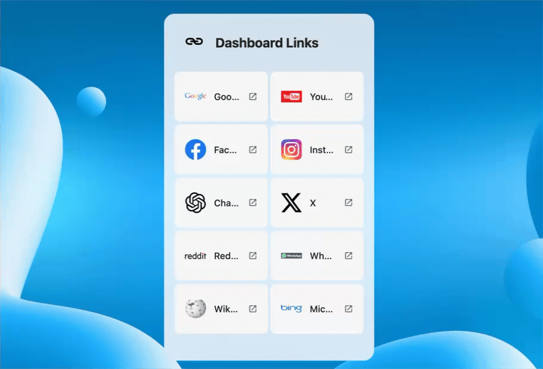
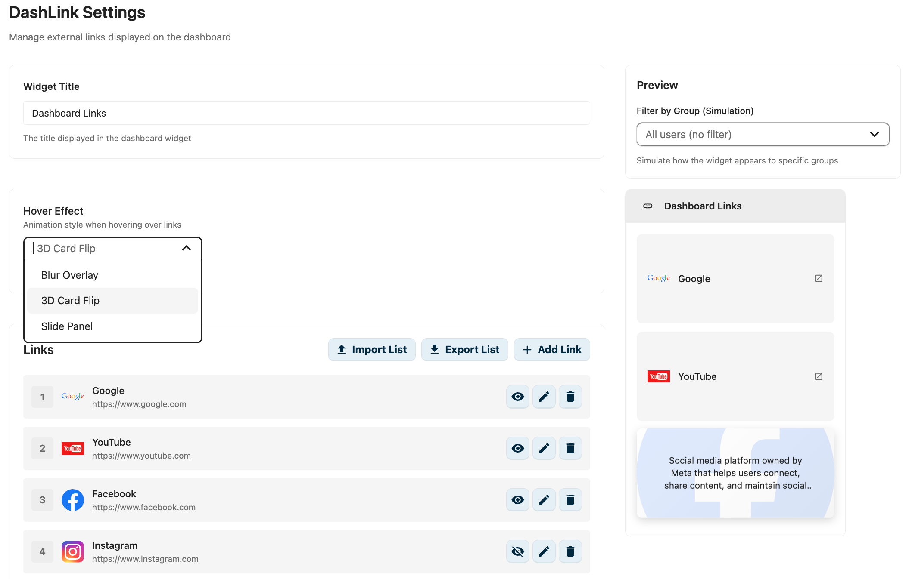

[](https://github.com/lexioj/dashlink/releases)
[](LICENSE)
[](https://nextcloud.com)
# DashLink - External Links Widget for Nextcloud

A Nextcloud dashboard widget that displays external website links with customizable hover effects using optional group-based visibility.

## Features

### Core Features

- **Dashboard Widget**: Display external links on the Nextcloud dashboard (limited to 10 visible at once)
- **Custom Icons**: Upload custom logos/icons for each website (PNG, JPG, GIF, SVG, WebP up to 2MB)
- **Modular Hover Effects**: Three built-in animation effects:
  - **Blur Overlay**: Description appears over a blurred logo background
  - **3D Card Flip**: Card flips to reveal description on the back
  - **Slide Panel**: Description panel slides up from the bottom
- **Group-Based Visibility**: Show links only to specific Nextcloud groups
- **Live Preview**: Real-time preview in the admin panel with group filter simulation
- **Responsive Design**: Adapts from 1 to 2 columns based on viewport
- **Dark Mode Compatible**: Full support for Nextcloud dark theme

### Admin Panel Features

- **Drag & Drop Reordering**: Visually reorder links with position number badges
- **CRUD Operations**: Create, read, update, and delete links with modern forms
- **Export/Import**:
  - Export all links to JSON with absolute Nextcloud URLs for icons
  - Import links from JSON with automatic duplicate detection (by title or URL)
  - Download and save icons from external URLs during import
- **Modern UI**: Nextcloud-style toggle switches, modals, and responsive layouts
- **Group Management**: Select multiple groups with autocomplete picker
- **Icon Management**: Upload, delete, or download icons from URLs
- **Widget Customization**: Configure widget title and hover effects globally

## Requirements

- **Nextcloud**: 31 or higher (required for Vue 3 support)
- **PHP**: 8.1 or higher
- **Node.js**: 20.x or higher (22.x tested and working)
- **npm**: 10.x or higher

## Installation

### From App Store (soon)
1. Navigate to Apps in your Nextcloud
2. Search for "DashLink"
3. Click Install

### Manual Installation
1. Clone this repository into your Nextcloud apps directory:
   ```bash
   cd /path/to/nextcloud/apps
   git clone https://github.com/yourusername/dashlink.git
   cd dashlink
   ```

2. Install dependencies:
   ```bash
   make composer   # Install PHP dependencies
   make npm        # Install Node.js dependencies
   ```

   **Note**: If you encounter peer dependency warnings during `npm install`, this is expected due to the Nextcloud ecosystem's ongoing Vue 2→3 transition. The app is fully compatible with the installed versions.

3. Build the frontend:
   ```bash
   make build      # Production build
   # OR
   make dev        # Development build with watch mode
   ```

   **Expected build output**:
   - `js/dashlink-dashlink-dashboard.js` (~120 KB) - Dashboard widget
   - `js/dashlink-dashlink-admin.js` (~500 KB) - Admin panel
   - You may see SCSS deprecation warnings - these are non-blocking and will be addressed in future sass-loader updates

4. Enable the app:
   ```bash
   php occ app:enable dashlink
   ```

### Troubleshooting

**Build Issues:**
- If you see module resolution errors, ensure you're using Node.js 20.x or higher
- If webpack fails with polyfill errors, try clearing node_modules and reinstalling:
  ```bash
  rm -rf node_modules package-lock.json
  npm install --legacy-peer-deps
  npm run build
  ```

**Vue 3 Compatibility:**
- This app uses @nextcloud/vue v9.x which requires Nextcloud 31+
- Older Nextcloud versions (≤30) are not compatible due to Vue 2 dependencies

## Usage

### For Administrators

1. Navigate to **Settings** → **Administration** → **DashLink**
2. Click **"Add Link"** to create a new link
3. Fill in the link details:
   - **Title**: Display name
   - **URL**: Target website URL
   - **Description**: Shown on hover (optional)
   - **Icon**: Upload a custom image (PNG, JPG, SVG up to 2MB)
   - **Open in**: Choose same tab or new tab
   - **Visible to Groups**: Select groups (leave empty for all users)
4. Select a **Hover Effect** from the dropdown
5. Preview your changes in the live preview panel

### For Users

1. Navigate to your **Dashboard**
2. The **DashLink** widget displays all links you have access to
3. Hover over links to see the animated description
4. Click to open the website

## Development

### Project Structure

```
dashlink/
├── appinfo/              # App configuration
│   ├── info.xml          # App metadata
│   ├── routes.php        # API routes
│   └── database.xml      # Database schema
├── lib/                  # PHP backend
│   ├── AppInfo/          # Bootstrap
│   ├── Controller/       # REST API controllers
│   ├── Dashboard/        # Dashboard widget
│   ├── Db/               # Database entities & mappers
│   ├── Migration/        # Database migrations
│   ├── Service/          # Business logic
│   └── Settings/         # Admin settings
├── src/                  # Vue.js frontend
│   ├── components/       # Vue components
│   ├── composables/      # Vue 3 composables
│   └── effects/          # Modular effect system
├── css/                  # SCSS styles
├── img/                  # App icons
└── templates/            # PHP templates
```

### Adding New Hover Effects

The effect system is modular and extensible. To add a new effect:

1. Create a new folder: `src/effects/effect_yourname/`
2. Create `index.js`:
   ```javascript
   import EffectYourname from './EffectYourname.vue'

   export default {
     id: 'yourname',
     name: 'Your Effect Name',
     description: 'What this effect does',
     component: EffectYourname,
   }
   ```

3. Create `EffectYourname.vue`:
   ```vue
   <template>
     <div v-if="isHovered && link.description">
       <!-- Your effect implementation -->
     </div>
   </template>

   <script>
   export default {
     name: 'EffectYourname',
     props: {
       link: { type: Object, required: true },
       isHovered: { type: Boolean, default: false }
     }
   }
   </script>
   ```

4. Register in `src/effects/index.js`:
   ```javascript
   import EffectYourname from './effect_yourname'

   const effects = {
     // ... existing effects
     yourname: EffectYourname,
   }
   ```

5. Update backend `lib/Service/SettingsService.php`:
   ```php
   private const AVAILABLE_EFFECTS = [
     // ... existing effects
     'yourname' => [
       'id' => 'yourname',
       'name' => 'Your Effect Name',
       'description' => 'What this effect does'
     ],
   ];
   ```

The effect will automatically appear in the admin dropdown!

### Build Commands

```bash
make dev        # Development build with watch mode
make build      # Production build
make composer   # Install PHP dependencies
make npm        # Install Node.js dependencies
make clean      # Clean build artifacts
make test       # Run tests
make lint       # Run linters
make fix        # Fix code style issues
make appstore   # Build app package for app store
```

### API Endpoints

**15 RESTful endpoints organized by functionality:**

**Public Routes (2):**
- `GET /api/v1/links` - Get user's links (filtered by groups)
- `GET /api/v1/links/{id}/icon` - Get link icon

**Admin Link Management (11):**
- `GET /api/v1/admin/links` - Get all links
- `POST /api/v1/admin/links` - Create link
- `PUT /api/v1/admin/links/{id}` - Update link
- `DELETE /api/v1/admin/links/{id}` - Delete link
- `POST /api/v1/admin/links/{id}/icon` - Upload icon
- `DELETE /api/v1/admin/links/{id}/icon` - Delete icon
- `PUT /api/v1/admin/links/order` - Update link order (drag & drop)
- `GET /api/v1/admin/links/export` - Export links to JSON
- `POST /api/v1/admin/links/import` - Import links from JSON
- `GET /api/v1/admin/groups` - Get available Nextcloud groups

**Admin Settings (2):**
- `GET /api/v1/admin/settings` - Get global settings
- `PUT /api/v1/admin/settings` - Update global settings

## Architecture

### Backend
- **PHP 8.1+** with Nextcloud App Framework
- **Database**: SQLite/MySQL/PostgreSQL via Nextcloud OCP
- **Services**: Dependency injection with business logic separation
- **Controllers**: RESTful API with JSON responses

### Frontend
- **Vue.js 3** with Composition API
- **@nextcloud/vue**: Nextcloud UI components
- **Webpack 5**: Module bundling
- **SCSS**: Styling with Nextcloud CSS variables

### Effect System
- **Modular Architecture**: Each effect is self-contained
- **Dynamic Loading**: Effects loaded via `getEffectComponent()`
- **Consistent Interface**: All effects receive same props
- **Easy Extension**: Add new effects without modifying core code

### Technical Notes

**Vue 3 Migration:**
- Uses @nextcloud/vue v9.x (first version with Vue 3 support)
- Component imports use new path format: `@nextcloud/vue/components/ComponentName`
- Requires Nextcloud 31+ due to Vue 3 framework dependencies

**Notifications:**
- Uses custom notification utility (`src/utils/notifications.js`) instead of @nextcloud/dialogs
- Relies on Nextcloud's global `OC.Notification` API to avoid dependency conflicts
- Compatible with all Nextcloud notification standards

**Build Configuration:**
- Webpack configured with Node.js polyfills (process, buffer) for browser compatibility
- `resolve.fullySpecified: false` to handle ESM import resolution
- Dual entry points: dashboard.js and admin.js for optimized bundle splitting

## License

This project is licensed under the **GNU Affero General Public License v3.0 or later** (AGPL-3.0-or-later).

See [LICENSE](LICENSE) for the full license text.

## Contributing

Contributions are welcome! Please:

1. Fork the repository
2. Create a feature branch (`git checkout -b feature/amazing-feature`)
3. Commit your changes (`git commit -m 'Add amazing feature'`)
4. Push to the branch (`git push origin feature/amazing-feature`)
5. Open a Pull Request

## Support

- **Issues**: [GitHub Issues](https://github.com/lexioj/dashlink/issues)
- **Discussions**: [GitHub Discussions](https://github.com/lexioj/dashlink/discussions)
- **Documentation**: See [docs/](docs/) folder for detailed implementation guides

## Changelog

See [CHANGELOG.md](CHANGELOG.md) for a complete list of changes and version history.
